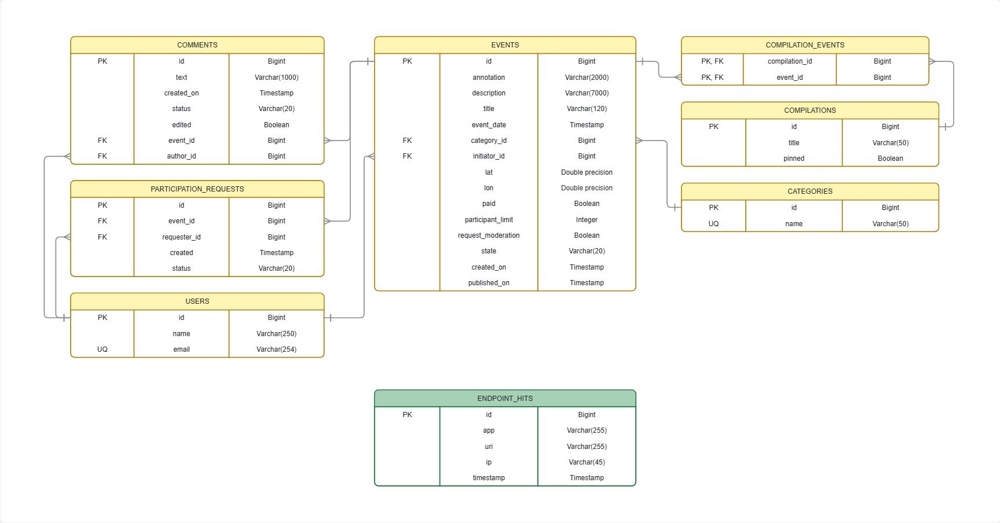

# Explore With Me

**Explore With Me (EWM)** - backend-приложение для публикации событий и поиска участников.

Пользователи могут находить интересные мероприятия, создавать собственные события и подавать заявки на участие, а администраторы — модерировать контент и управлять пользователями, категориями и подборками событий.

Дополнительная функциональность проекта:  
💬 [Комментарии к событиям](https://github.com/GolovachevaNP/java-explore-with-me/pull/5)

---

## О проекте

Explore With Me помогает организовать совместный досуг: пользователь публикует событие, другие пользователи находят его через публичный каталог и отправляют заявки на участие.

Каждое событие проходит жизненный цикл:

`PENDING` → `PUBLISHED` или `CANCELED`

Проект состоит из двух независимо запускаемых сервисов:

- **Основной сервис** - хранит пользователей, события, заявки на участие, категории, подборки и комментарии.
- **Сервис статистики** - сохраняет обращения к публичным эндпоинтам и предоставляет агрегированную статистику просмотров.

По учебной спецификации аутентификация и авторизация закрытого и административного API выполняются внешним шлюзом.

---

## Основная функциональность

### Публичный API

- поиск и фильтрация опубликованных событий;
- поиск по тексту;
- фильтрация по категориям;
- фильтрация по платности;
- фильтрация по диапазону дат;
- фильтрация по доступности мест;
- сортировка событий;
- просмотр полной информации об опубликованном событии;
- просмотр категорий;
- просмотр подборок событий;
- просмотр опубликованных комментариев;
- учёт просмотров публичных событий.

### API пользователей

- создание событий;
- просмотр собственных событий;
- редактирование собственных событий;
- подача заявок на участие;
- просмотр и отмена заявок;
- подтверждение и отклонение заявок инициатором события;
- создание и редактирование комментариев;
- просмотр собственных комментариев.

### Административный API

- управление пользователями;
- управление категориями;
- управление подборками событий;
- публикация и отклонение событий;
- модерация комментариев.

---

## Архитектура

Основной сервис построен по слоистой архитектуре:

```text
controller → service → repository
```

Модели предметной области преобразуются в DTO с помощью **MapStruct**.

Для обработки ошибок используются централизованные обработчики исключений.

Сервис статистики состоит из трёх Maven-модулей:

- `stats-server` - REST-сервис статистики;
- `stats-client` - HTTP-клиент на базе JDK `HttpClient`;
- `stats-dto` - общие DTO запросов и ответов.

Основной сервис фиксирует обращения к публичным эндпоинтам:

```text
GET /events
GET /events/{eventId}
```

Для каждого запроса в сервис статистики передаются URI и IP-адрес клиента.

---

## Стек технологий

### Backend

- Java 21
- Spring Boot 3.3.2
- Spring Web
- Spring Validation
- Spring Data JPA
- Hibernate / JPA
- Spring Boot Actuator
- REST API

### Базы данных

- PostgreSQL 16.1
- H2

### Взаимодействие сервисов

- JDK `HttpClient`
- Jackson

### Сборка и инфраструктура

- Maven
- Docker
- Docker Compose

### Вспомогательные библиотеки

- Lombok
- MapStruct

### Тестирование

- JUnit 5
- Mockito
- Spring MockMvc
- H2

### Контроль качества

- Checkstyle
- SpotBugs
- JaCoCo

---

## Структура проекта

```text
.
├── ewm-main-service/
│   └── src/main/java/ru/practicum/
│       ├── category/              # Категории
│       ├── comment/               # Комментарии
│       ├── compilation/           # Подборки
│       ├── event/                 # События
│       ├── request/               # Заявки на участие
│       ├── user/                  # Пользователи
│       ├── config/                # Конфигурация
│       ├── exception/             # Обработка ошибок
│       └── ExploreWithMeApplication.java
│
├── ewm-stats-service/
│   ├── stats-server/              # REST API статистики
│   ├── stats-client/              # HTTP-клиент
│   └── stats-dto/                 # Общие DTO
│
├── postman/
│   └── feature.json               # Postman-коллекция комментариев
│
├── docker-compose.yml
├── ewm-main-service-spec.json
├── ewm-stats-service-spec.json
└── ERD-EWM.jpg
```

---

## API

Полные контракты API находятся в файлах:

- [`ewm-main-service-spec.json`](./ewm-main-service-spec.json)
- [`ewm-stats-service-spec.json`](./ewm-stats-service-spec.json)

Основные маршруты:

| Контур | Основные маршруты |
| --- | --- |
| Публичный | `GET /events`, `GET /events/{eventId}`, `GET /categories`, `GET /compilations`, `GET /events/{eventId}/comments` |
| Пользовательский | `/users/{userId}/events`, `/users/{userId}/requests`, маршруты комментариев пользователя |
| Административный | `/admin/users`, `/admin/categories`, `/admin/events`, `/admin/compilations`, `/admin/comments` |
| Статистика | `POST /hit`, `GET /stats` |

---

## Комментарии

В качестве дополнительной функциональности реализованы **комментарии к событиям с предварительной модерацией**.

Комментарий можно оставить только к опубликованному событию.

После создания комментарий получает статус:

```text
PENDING
```

Администратор может изменить его на:

```text
PUBLISHED
```

или:

```text
REJECTED
```

Особенности работы с комментариями:

- публичный API возвращает только опубликованные комментарии;
- автор видит собственные комментарии во всех статусах;
- текст комментария очищается методом `trim()`;
- допустимая длина текста — от 1 до 1000 символов;
- после редактирования комментарий повторно отправляется на модерацию;
- для ранее опубликованного и затем отредактированного комментария устанавливается признак `edited`.

Реализация функциональности:  
[Pull Request #5 - комментарии к событиям](https://github.com/GolovachevaNP/java-explore-with-me/pull/5)

---

## База данных

Проект использует две отдельные базы PostgreSQL.

| База данных | Таблицы |
| --- | --- |
| `ewm` | `users`, `categories`, `events`, `participation_requests`, `compilations`, `compilation_events`, `comments` |
| `stats` | `endpoint_hits` |

Основные связи:

- событие связано с категорией;
- событие связано с пользователем-инициатором;
- заявка на участие связана с событием и пользователем;
- подборки и события имеют связь многие-ко-многим через `compilation_events`;
- комментарий связан с событием и его автором.

### ER-диаграмма



---

## Запуск приложения

### Требования

Для запуска проекта необходимы:

- JDK 21;
- Maven 3.9+;
- Docker Engine;
- Docker Compose.

### Клонирование проекта

```bash
git clone https://github.com/GolovachevaNP/java-explore-with-me.git
cd java-explore-with-me
```

### Сборка

```bash
mvn clean package
```

### Запуск в Docker

```bash
docker compose up --build
```

После запуска доступны:

| Компонент | Адрес |
| --- | --- |
| Основной сервис | `http://localhost:8080` |
| Сервис статистики | `http://localhost:9090` |
| БД основного сервиса | `localhost:5433`, база `ewm` |
| БД статистики | `localhost:5432`, база `stats` |
| Health-check основного сервиса | `http://localhost:8080/actuator/health` |
| Health-check статистики | `http://localhost:9090/actuator/health` |

### Остановка

```bash
docker compose down
```

---

## Тестирование

В проекте реализованы автоматические тесты различных уровней.

Всего:

- **25 тестовых классов**;
- **81 метод с аннотацией `@Test`**;
- **29 Postman-сценариев** для дополнительной функциональности комментариев.

Используются:

- модульные тесты сервисного слоя с Mockito;
- MVC-тесты REST-контроллеров через MockMvc;
- интеграционные тесты Spring Boot с H2;
- тесты сервиса статистики;
- тесты HTTP-клиента;
- Postman-коллекция для проверки комментариев.

### Запуск тестов

```bash
mvn test
```

### Полная проверка проекта

```bash
mvn clean verify
```

При полной проверке также выполняются настроенные проверки качества кода.

---

## Что реализовано

В рамках проекта реализованы:

- многомодульная Maven-сборка;
- два независимо запускаемых Spring Boot-сервиса;
- две PostgreSQL БД;
- контейнерный запуск через Docker Compose;
- работа с пользователями;
- категории событий;
- создание и управление событиями;
- подборки событий;
- заявки на участие;
- публичный, пользовательский и административный REST API;
- отдельный сервис статистики;
- HTTP-клиент для межсервисного взаимодействия;
- поиск и фильтрация событий;
- сортировка и пагинация;
- валидация входных данных;
- централизованная обработка ошибок;
- жизненные циклы событий и заявок;
- комментарии с предварительной модерацией;
- повторная отправка комментариев на модерацию после редактирования;
- unit-, MVC- и интеграционные тесты;
- автоматические проверки через Checkstyle, SpotBugs и JaCoCo.

---

## Выводы

В ходе проекта я реализовала многомодульное backend-приложение с разделением ответственности между основным сервисом и отдельным сервисом статистики, настроила их взаимодействие по HTTP и контейнерный запуск вместе с двумя PostgreSQL БД.

Проект позволил закрепить работу со **Spring Boot, Spring Data JPA, REST API, PostgreSQL, реляционной моделью данных, валидацией и обработкой ошибок**, а также практику модульного, MVC- и интеграционного тестирования.

При реализации дополнительной функциональности комментариев спроектировала отдельный жизненный цикл пользовательского контента с предварительной модерацией и повторной отправкой на проверку после редактирования.
